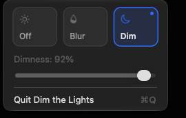
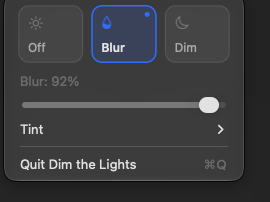

# Dim the Lights

A free, open-source macOS menu bar app that dims or blurs everything except the window you're focused on.

<p align="center">
  
  &nbsp;&nbsp;
  
</p>

- **Off / Blur / Dim** modes, switched from the menu bar.
- One intensity slider for both Blur and Dim (default 75%).
- Blur tints: None, Dark, Light, or your system accent color.
- The Dock, desktop and picture-in-picture windows are covered too. The menu bar stays bright.
- Works across all displays.
- No permissions needed: it reads window positions, never window contents.
- One Swift file, no dependencies.

## Install

Download `DimTheLights-x.y.z.dmg` from the [latest release](https://github.com/iamashwincherian/dim-the-lights/releases/latest), open it and drag the app to Applications.

The app isn't notarized (no paid Apple Developer ID), so the first launch is blocked by Gatekeeper. Right-click the app, choose **Open**, then **Open** again. Or run:

```sh
xattr -dr com.apple.quarantine /Applications/DimTheLights.app
```

Requires macOS 13 or later. Universal binary (Apple silicon and Intel).

## Build

Requires macOS and the Xcode command line tools (`xcode-select --install`).

```sh
./build.sh        # builds DimTheLights.app
./build.sh dmg    # also builds the DMG
open DimTheLights.app
```

Drag `DimTheLights.app` into Applications. To start it at login, add it in System Settings → General → Login Items.

## Known limits

- The bright area follows the focused window 30 times a second, so it trails slightly while you drag.
- Blur intensity fades the blur in and out; macOS has no public API to set a blur radius.
- The bright area uses a fixed 12 pt corner radius (`cornerRadius` in `main.swift`).

## License

MIT
